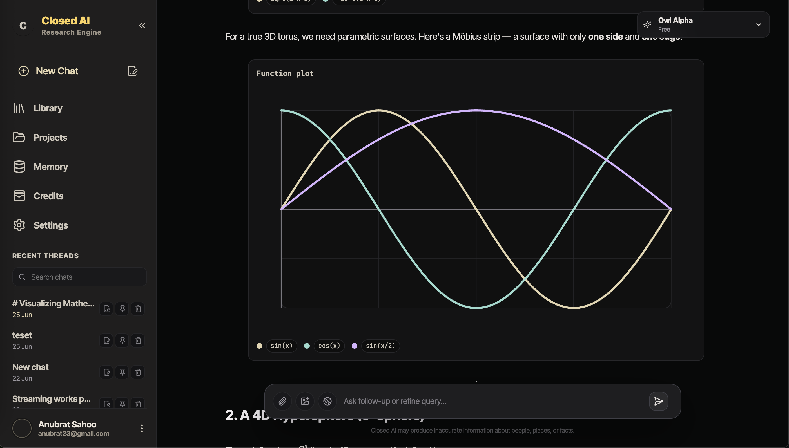
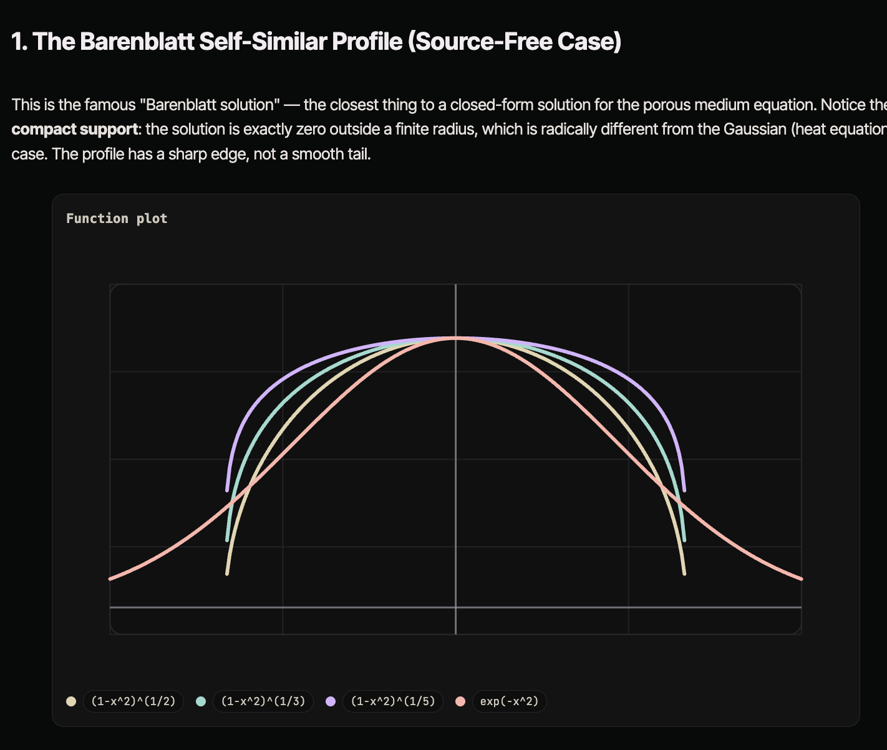
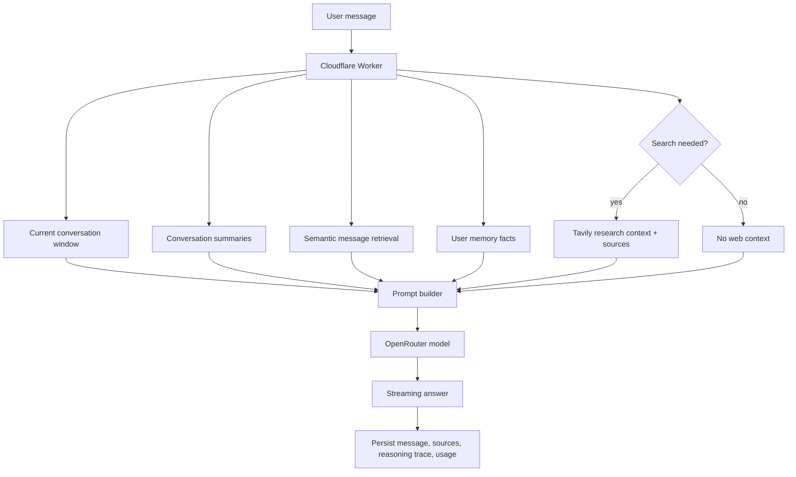

# Closed AI

Closed AI is a chat and research app built around strong open-source models, persistent conversation history, web search, visual artifacts, and a credit-based pricing model.

The goal is simple: make capable AI assistance affordable and useful for students and builders who need answers, explanations, code help, math support, and research workflows without paying frontier-model subscription prices.

Most chat products hide the interesting parts of their stack. This repo is intentionally more open: the model router, context pipeline, artifact renderer, search flow, and payment layer are all visible.

<p>
  <a href="https://closedai.anxbrt.dev/" target="_blank" rel="noopener noreferrer">
    
  </a>
  
</p>

## Screenshots

<p>
  
</p>

**A research workspace, not just a chat box.** Closed AI keeps the conversation, library, projects, memory, credits, and settings visible without burying the answer. The model can explain an idea and render a visual artifact in the same thread, so a math or research answer feels inspectable instead of static.

**From text to visual reasoning.** The assistant can turn formulas into plots, diagrams, HTML previews, and structured artifacts directly inside the chat. That matters for students and builders: you do not just read the explanation, you can see the shape of the idea.

<p>
  
</p>

**Built for explanations that carry evidence.** In the math view, the answer introduces the concept, highlights the important behavior, and then renders the generated plot underneath. The UI is dark, focused, and designed to keep dense technical content readable.

## Features

- **Model switching** through OpenRouter, with support for large-context and reasoning-capable models.
- **Streaming chat** through a Cloudflare Worker.
- **Conversation history** backed by Supabase.
- **Web research mode** with source cards and citations.
- **Artifacts** for diagrams, charts, plots, HTML previews, geometry, and molecule-style visual blocks.
- **Reasoning controls** for models that expose effort levels.
- **Credit wallet** with Razorpay checkout.
- **Mobile-first Expo app** and a React web app.

## Why Star This Repo?

Closed AI is useful as a working reference implementation for:

- Building a Claude-style chat UI without owning model infrastructure.
- Routing between open-source models while preserving one product experience.
- Streaming through a Worker instead of exposing provider keys to clients.
- Combining short-term chat history, long-term memory, summaries, and search context.
- Rendering model-generated artifacts instead of treating every answer as plain text.
- Shipping the same product idea across mobile and web.

## Architecture

```text
Expo app / React web app
  ├─ Supabase: auth, conversations, messages, storage, profile, credits
  └─ Cloudflare Worker
       ├─ OpenRouter: chat completions
       ├─ Tavily: web search
       ├─ Razorpay: payment order + verification
       └─ Supabase service role: server-side writes
```

More design context lives in [ARCHITECTURE.md](./ARCHITECTURE.md).

## Context Management

Closed AI does not send the entire database to the model. Each request builds a compact context packet from several layers, then streams that packet through OpenRouter.



The context stack currently uses:

- **Current turn + recent messages** for immediate continuity.
- **Conversation summaries** for older spans that would otherwise exceed the context budget.
- **Semantic message retrieval** through Supabase RPC `match_messages`, using embeddings of the latest user message.
- **Memory facts** through Supabase RPC `match_memory_facts`, with a higher similarity threshold so only strongly relevant user facts are injected.
- **Search context** when research mode or intent detection decides the model needs current external information.
- **Token-aware output sizing** so the Worker leaves enough room for a useful answer instead of filling the whole window with prompt context.

This is deliberately boring infrastructure: summaries keep long chats coherent, retrieval brings back exact old turns, memory keeps stable user facts separate from conversation text, and web search stays opt-in or intent-triggered.

## Supported Models

| Model | OpenRouter ID | Notes |
| --- | --- | --- |
| Qwen3.6 Plus | `qwen/qwen3.6-plus` | Default model |
| DeepSeek V4 Pro | `deepseek/deepseek-v4-pro` | Reasoning-capable |
| Kimi K2 Thinking | `moonshotai/kimi-k2-thinking` | Always-on reasoning |
| GLM-5.2 | `z-ai/glm-5.2` | Agentic reasoning |

## Local Development

Install dependencies:

```bash
npm install
cd web && npm install
cd ../worker && npm install
```

Run the Expo app:

```bash
npx expo start
```

Run the web app:

```bash
cd web
npm run dev
```

Run the Worker locally:

```bash
cd worker
npm run dev
```

## Environment

The app expects Supabase, OpenRouter, Razorpay, and optional search provider credentials.

Root/mobile env examples:

```env
EXPO_PUBLIC_SUPABASE_URL=
EXPO_PUBLIC_SUPABASE_ANON_KEY=
EXPO_PUBLIC_WORKER_URL=
EXPO_PUBLIC_RAZORPAY_KEY_ID=
```

Web env examples:

```env
VITE_SUPABASE_URL=
VITE_SUPABASE_ANON_KEY=
VITE_WORKER_URL=
VITE_RAZORPAY_KEY_ID=
```

Worker env examples:

```env
SUPABASE_URL=
SUPABASE_SECRET_KEY=
OPENROUTER_API_KEY=
RAZORPAY_KEY_ID=
RAZORPAY_KEY_SECRET=
TAVILY_API_KEY=
```

## Deploy

Apply Supabase migrations:

```bash
supabase db push
```

Deploy the Worker:

```bash
cd worker
npx wrangler deploy
```

Build the web app:

```bash
cd web
npm run build
```

Publish an Expo OTA update:

```bash
npx eas update --branch production --message "update message"
```
